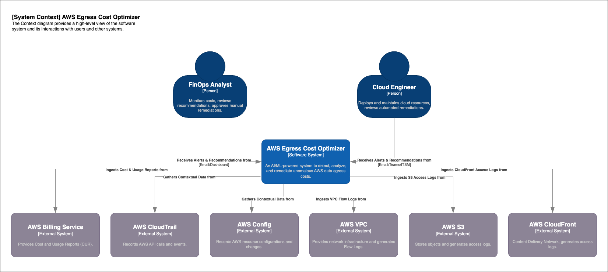
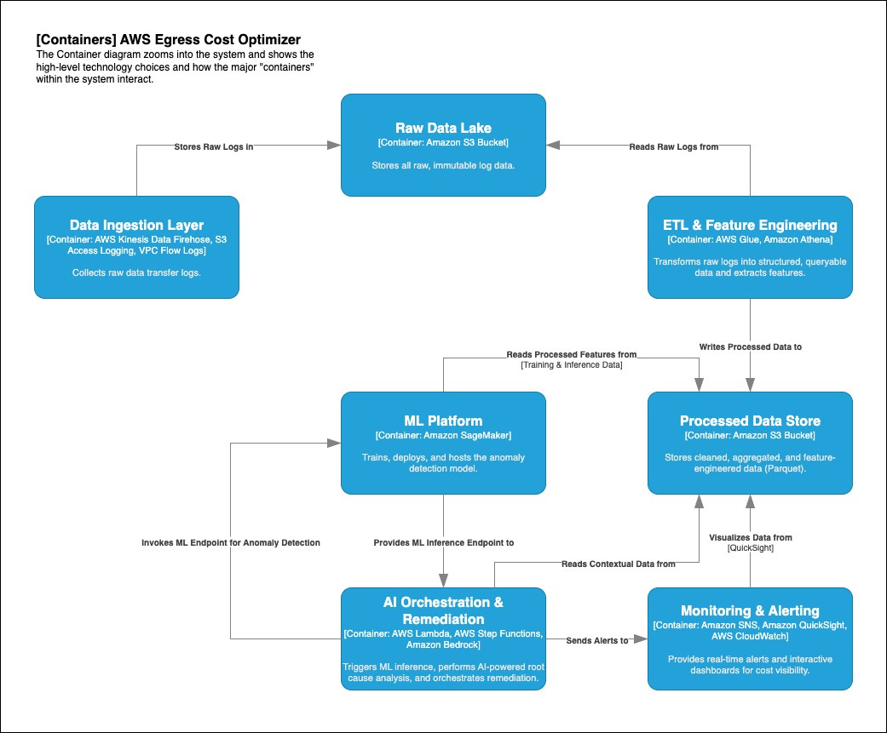
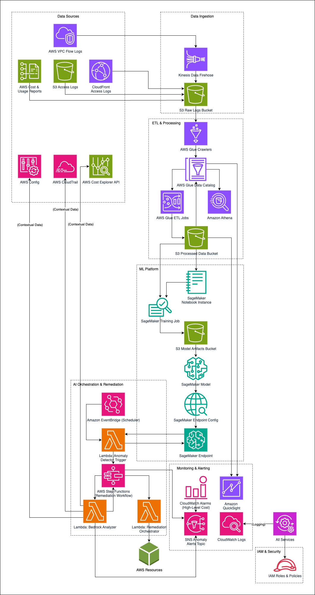

# 2. Architecture Deep Dive

Understanding the architecture is key to comprehending how the AWS Egress Cost Optimizer operates. I'll explain it through the C4 Model and a detailed AWS Infrastructure Architecture diagram.

## 2.1. C4 Model - Context Diagram

The Context diagram provides a high-level view of the software system and its interactions with users and other systems.

## 2.2. C4 Model - Container Diagram

The Container diagram zooms into the system and shows the high-level technology choices and how the major "containers" (applications/services) within the system interact.

## 2.3. AWS Infrastructure Architecture Diagram

This diagram provides a detailed view of the AWS services used and their interactions within the solution.

## 2.4. AWS Services

Here's a breakdown of the key AWS services and their roles in the solution:

- **Data Sources:**

    - ***AWS Cost & Usage Reports (CUR):*** The most granular source of billing data, including detailed usage types for data transfer. Delivered to an S3 bucket.
    - ***AWS VPC Flow Logs:*** Captures IP traffic information for VPCs, including source/destination IP, ports, and bytes transferred. Essential for identifying egress hotspots at the network level.
    - ***Amazon S3 Access Logs:*** Records requests made to the S3 buckets, useful for understanding data access patterns that contribute to egress.
    - ***Amazon CloudFront Access Logs:*** Provides detailed logs of user requests delivered via CloudFront, crucial for optimizing CDN usage and identifying cache misses that lead to origin egress.
    - ***AWS Config:*** Records configuration changes of the AWS resources, providing valuable context for root cause analysis (e.g., "Was an S3 bucket policy changed recently?").
    - ***AWS CloudTrail:*** Logs API calls and events made in the AWS account, helping to identify user or service actions that might have led to an egress anomaly.
    - ***AWS Cost Explorer API:*** Allows programmatic access to cost and usage data for more real-time or granular queries than CUR.

- **Data Ingestion:**

    - ***AWS Kinesis Data Firehose:*** A fully managed service for delivering real-time streaming data to S3. Used to ingest VPC Flow Logs efficiently.
    - ***S3 Raw Logs Bucket:*** The central landing zone for all raw, immutable log data from CUR, VPC Flow Logs, S3 Access Logs, and CloudFront Access Logs.

- **ETL & Processing:**

    - ***AWS Glue Crawlers:*** Automatically discover schema from raw data in the S3 Raw Logs Bucket and populate the AWS Glue Data Catalog.
    - ***AWS Glue Data Catalog:*** A metadata repository that stores schemas for the data, allowing services like Athena and SageMaker to query data directly from S3.
    - ***AWS Glue ETL Jobs:*** Serverless Apache Spark jobs that clean, transform, aggregate, and enrich the raw log data. They combine data from different sources and extract features relevant for anomaly detection.
    - ***S3 Processed Data Bucket:*** Stores the output of Glue ETL jobs in a structured, query-optimized format (e.g., Parquet), ready for ML training, inference, and QuickSight.
    - ***Amazon Athena:*** An interactive query service that makes it easy to analyze data directly in S3 using standard SQL. Used for ad-hoc exploration and as a data source for QuickSight.

- **ML Platform:**

    - ***Amazon SageMaker Notebook Instance:*** A managed Jupyter notebook environment for interactive data exploration, model development, and experimentation.
    - ***Amazon SageMaker Training Job:*** A managed service for training ML models. It executes the training script on scalable infrastructure, saving the trained model artifacts to S3.
    - ***S3 Model Artifacts Bucket:*** Stores trained ML models (model.tar.gz), pre-processing scripts, and other artifacts generated during the ML lifecycle.
    - ***Amazon SageMaker Model:*** A SageMaker resource that points to a trained model artifact in S3 and defines the Docker image for inference.
    - ***Amazon SageMaker Endpoint Configuration:*** Specifies the compute resources (instance type, count) for a SageMaker inference endpoint.
    - ***Amazon SageMaker Endpoint:*** A fully managed, real-time inference endpoint that hosts the trained anomaly detection model, allowing other services (like Lambda) to send data and receive predictions.

- **AI Orchestration & Remediation:**

    - ***Amazon EventBridge (Scheduler):*** Triggers the Anomaly Detector Trigger Lambda function periodically (e.g., hourly) to initiate the anomaly detection process.
    - ***AWS Lambda (Anomaly Detector Trigger):*** Fetches the latest processed data, invokes the SageMaker Endpoint for anomaly detection, and, if anomalies are found, triggers the AWS Step Functions workflow.
    - ***AWS Step Functions (Remediation Workflow):*** Orchestrates complex, multi-step processes. It acts as the central coordinator, routing detected anomalies to the Bedrock Analyzer or Remediation Orchestrator based on anomaly type and severity. It also handles retries and error management.
    - ***AWS Lambda (Bedrock Analyzer):*** Triggered by Step Functions for detected anomalies. It gathers additional contextual data from AWS Config, CloudTrail, and Cost Explorer. It then uses Amazon Bedrock (a fully managed service for foundation models) to invoke a Large Language Model (LLM) to perform intelligent root cause analysis and generate actionable recommendations in natural language.
    - ***AWS Lambda (Remediation Orchestrator):*** Triggered by Step Functions. It executes specific, predefined automated remediation actions (e.g., blocking public S3 access, revoking overly permissive security group rules) based on the anomaly type.

- **Monitoring & Alerting:**

    - ***Amazon SNS (Anomaly Alerts Topic):*** A notification service used to send immediate alerts (e.g., email, SMS, integration with PagerDuty/Slack) when anomalies are detected, or remediation actions are taken/failed.
    - ***AWS CloudWatch Alarms:*** Set up on high-level AWS Cost Explorer metrics to provide a basic safety net for significant cost spikes, complementing the ML-driven anomaly detection.
    - ***Amazon QuickSight:*** A cloud-native, serverless BI service used to create interactive dashboards for visualizing egress cost trends, identifying top spenders, and displaying detected anomalies and their root causes.
    - ***AWS CloudWatch Logs:*** Centralized logging for all Lambda functions, Glue jobs, SageMaker endpoints, and other services, essential for debugging and auditing the solution's operation.

- **IAM & Security:**

    - ***IAM Roles & Policies:*** Define the permissions for each AWS service to interact securely with other services, adhering to the principle of least privilege.

This comprehensive architecture ensures that every aspect of egress cost optimization, from data ingestion to intelligent analysis and automated response, is covered by dedicated and interconnected AWS services.
