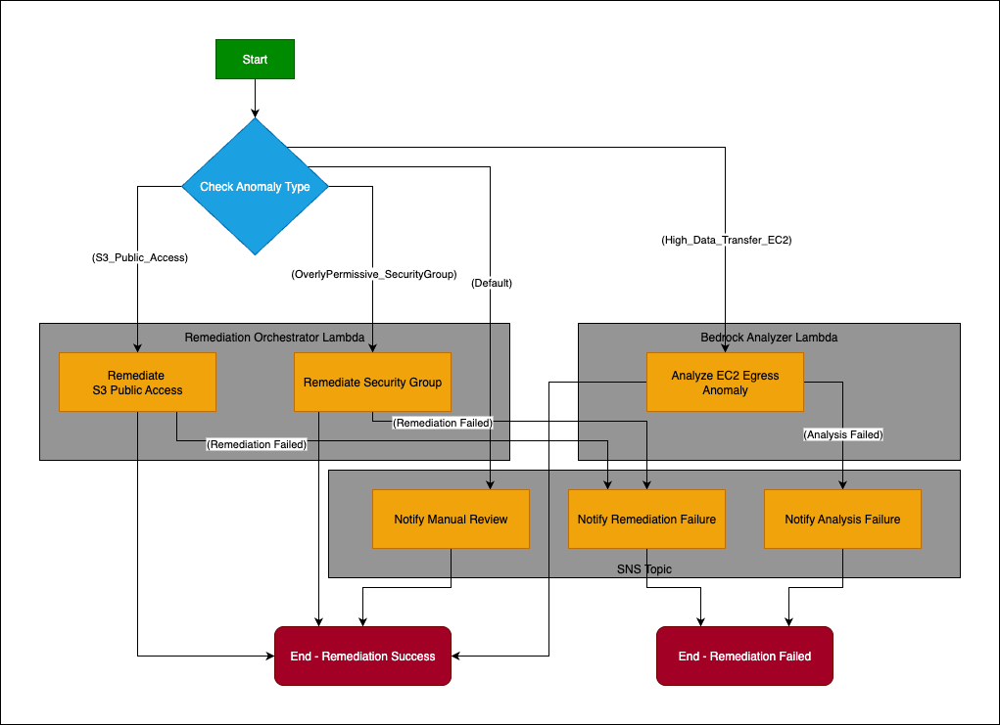

# 5. Application Logic (Lambda & Bedrock)

This section details the core serverless application logic that drives the intelligent detection, analysis, and orchestration of the AWS Egress Cost Optimizer. These components are primarily implemented using AWS Lambda functions and leverage Amazon Bedrock for AI-powered insights.

## 5.1. Overview

1. The application logic is designed as an event-driven system:
2. A scheduled event triggers the anomaly detection.
3. Anomalies, once detected, initiate a Step Functions workflow.
4. The Step Functions workflow orchestrates calls to various Lambda functions for contextual analysis (Bedrock Analyzer) and automated remediation (Remediation Orchestrator).
5. Alerts are sent via SNS throughout the process.

## 5.2. Lambda Functions

All Lambda functions are written in Python and deployed as ZIP packages to an S3 bucket. They use AWS SDK (Boto3) and leverage IAM Roles for permissions, adhering to the principle of least privilege.

### 5.2.1. `anomaly_detector_trigger/`

- **Purpose:** The entry point for the anomaly detection process. It periodically checks for new data and triggers the ML inference.
- **Trigger:** Scheduled by Amazon EventBridge (e.g., hourly).
- **Key Actions:**

    - Fetches the latest processed egress data (e.g., hourly/daily aggregates) from the S3 Processed Data Bucket.
    - Invokes the Amazon SageMaker Endpoint (egress-anomaly-detector-endpoint) with the latest data to get anomaly predictions.
    - If anomalies are detected (is_anomaly == 1), it initiates an execution of the AWS Step Functions remediation workflow, passing detailed anomaly information as input.
    - Publishes critical errors to an SNS topic.

- **Dependencies** (`requirements.txt`): `boto3`, `pandas`, `pyarrow`

### 5.2.2. `bedrock_analyzer/`

- **Purpose:** Performs AI-powered root cause analysis and generates actionable recommendations for detected anomalies.
- **Trigger:** Invoked by the AWS Step Functions workflow when an anomaly is identified.
- **Key Actions:**

    - Receives anomaly details (resource ID, anomaly type, cost impact) as input from Step Functions.
    - **Contextual Data Gathering:** Programmatically queries various AWS services to gather relevant context:

        - **AWS Config:** Retrieves recent configuration changes for the affected resource.
        - **AWS CloudTrail:** Looks up recent API calls related to the resource or service.
        - **AWS Cost Explorer:** Fetches broader cost breakdown around the anomaly time.

    - **Prompt Engineering:** Loads a dynamic prompt template (`egress_root_cause_prompt.txt`) from an S3 bucket.
    - **Amazon Bedrock Invocation:** Constructs a comprehensive prompt using anomaly details and gathered context, then invokes a Large Language Model (LLM) (e.g., Claude, Titan) via Amazon Bedrock.
    - **Analysis & Recommendation Generation:** The LLM analyzes the provided data and generates a human-readable root cause analysis and actionable recommendations.
    - **Alerting:** Publishes the enriched analysis and recommendations to the SNS Anomaly Alerts Topic.

- **Dependencies** (`requirements.txt`): `boto3`, `pandas` (for datetime operations), `requests` (if making HTTP calls to other services/APIs).
- **Bedrock Prompt Template** (`bedrock_prompts/egress_root_cause_prompt.txt`):

    - A plain text file stored in S3 that defines the structure and instructions for the LLM.
    - Uses placeholders (e.g., `{anomaly_type}`, `{resource_id}`, `{context_data}`) that are dynamically filled by the Lambda function. This allows for flexible prompt engineering without redeploying Lambda code.

### 5.2.3. `remediation_orchestrator/`

- **Purpose:** Executes specific, automated remediation actions for identified non-compliance or anomaly root causes.
- **Trigger:** Invoked by the AWS Step Functions workflow based on the anomaly type.
- **Key Actions:**

    - Receives an `action` parameter (e.g., `remediate_s3_public_access`, `remediate_security_group`) and the `resourceId` from Step Functions.
    - `remediate_s3_public_access`: Blocks all public access settings for a specified S3 bucket.
    - `remediate_security_group`: Revokes overly permissive ingress rules (e.g., 0.0.0.0/0) from a specified Security Group.
    - Publishes the remediation status (success/failure/no action) to the SNS Anomaly Alerts Topic.

- **Dependencies** (`requirements.txt`): `boto3`

## 5.3. AWS Step Functions Workflow

The AWS Step Functions (Remediation Workflow) acts as the central orchestrator for the AI-driven response.

- **Workflow Definition:** Defined in JSON, it uses a state machine to manage the flow.
- **`CheckAnomalyType` (Choice State):** Routes the execution path based on the anomalyType identified by the SageMaker model.
- **`RemediateS3PublicAccess` (Task State):** Invokes the `remediation_orchestrator` Lambda with the `remediate_s3_public_access` action.
- **`RemediateSecurityGroup` (Task State):** Invokes the `remediation_orchestrator` Lambda with the `remediate_security_group` action.
- **`AnalyzeEC2EgressAnomaly` (Task State):** Invokes the `bedrock_analyzer` Lambda for detailed AI analysis.
- **`NotifyManualReview` (Task State):** Publishes a generic alert to SNS if the anomaly type is not specifically handled by automated remediation.
- **Error Handling (`Retry` and `Catch`):** Includes robust error handling to retry failed Lambda invocations and catch errors, routing them to failure notification states.
- **Success/Failure Notifications:** Publishes detailed messages to SNS upon successful remediation, remediation failure, or analysis failure.

This application logic forms the intelligent core of the solution, enabling automated detection, analysis, and response to egress cost anomalies.

